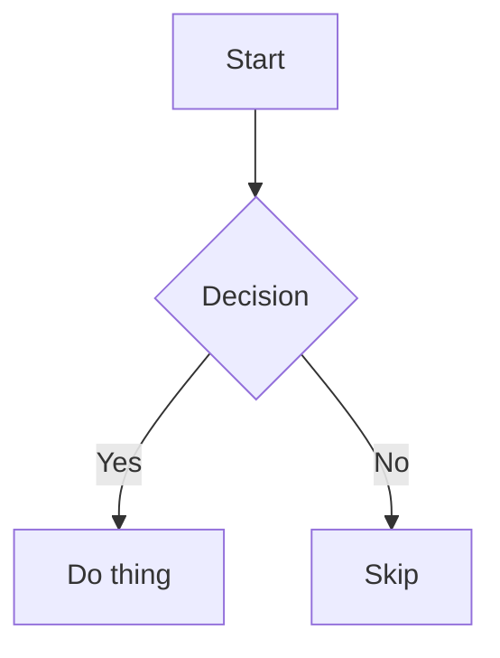

# DependsiT Markdown Studio

A privacy-first Markdown editor and document converter that runs entirely in your browser. Import PDF, DOCX, PPTX, XLSX, and more — your files never leave your device.

[](https://opensource.org/licenses/MIT)
[](https://nextjs.org)
[](https://www.typescriptlang.org)
[](https://md.dependsit.com)

---

## Why Markdown Studio?

- **100% client-side** — No servers, no databases, no tracking. All file parsing and editing happens in your browser via WebAssembly.
- **Import anything** — Drag and drop PDF, Word, PowerPoint, Excel, CSV, HTML, JSON, XML, EPUB, and RTF files. They're converted to Markdown instantly.
- **Rich preview** — GitHub-Flavored Markdown tables, KaTeX math formulas, and Mermaid diagrams render live as you type.
- **Export everywhere** — Markdown, PDF, Word (.docx), HTML, or plain text.
- **Tabbed workspace** — Multiple open files with IndexedDB persistence. Your work survives page refreshes.
- **Works offline** — Install as a Progressive Web App for full offline editing.

---

## User Guide

For detailed documentation covering every feature — from importing files to exporting, writing Markdown, using the command palette, find & replace, document statistics, themes, snippets, and more — see the **[User Guide](docs/USER_GUIDE.md)**.

### Quick Start

1. **Write** — Start typing in the editor. The right pane shows a live preview.
2. **Import** — Drag a file onto the window, or use **File → Import File**. Supported formats:
   - PDF (`.pdf`) — parsed client-side with pdf.js
   - Word (`.docx`) — parsed with mammoth.js
   - PowerPoint (`.pptx`), Excel (`.xlsx`), CSV, HTML, JSON, XML, EPUB, RTF — converted via Pyodide/MarkItDown in a background Web Worker
3. **Export** — **File → Export as** → choose Markdown, PDF, Word, HTML, or Plain Text.

### Keyboard Shortcuts

Press **Ctrl /** (macOS: **Cmd /**) at any time to see the full list. Here are the essentials:

| Shortcut | Action |
|---|---|
| `Ctrl S` | Save now |
| `Ctrl K` | Command palette |
| `Ctrl F` | Find |
| `Ctrl H` | Find and replace |
| `Ctrl P` | Print |
| `Ctrl N` | New tab |
| `Ctrl W` | Close tab |
| `Ctrl Shift D` | Duplicate tab |
| `Ctrl J` | Cycle theme (light → sepia → dark) |
| `Ctrl Shift L` | Toggle document outline |
| `Ctrl Shift Enter` | Focus / zen mode |
| `Ctrl Shift S` | Document statistics |
| `Alt 1–9` | Switch to tab 1–9 |

### Command Palette

Press **Ctrl K** to open the command palette. It gives you quick access to every action plus Markdown snippets (headings, bold, code blocks, tables, Mermaid diagrams, math, and more). You can also create custom snippets via the snippet manager (bookmark icon in the toolbar).

### Themes

Three built-in themes: **Light**, **Sepia** (warm, low-contrast for extended reading), and **Dark**. Click the theme icon in the toolbar or press **Ctrl J** to cycle.

### Word Count Goal

Click "Set goal" in the status bar to set a writing target. A progress ring shows how close you are, and turns green when you hit your goal.

### Document Statistics

Press **Ctrl Shift S** (or click the chart icon) to see detailed stats: word/character/line counts, paragraph and sentence counts, reading time, Flesch reading ease score, and grade level.

### Mermaid Diagrams

Use standard Mermaid code blocks:



Hover over any rendered diagram to download it as SVG or PNG.

### Print

Press **Ctrl P** to print the rendered preview. The print stylesheet hides the editor chrome and produces a clean, paginated document.

---

## Developer Guide

### Tech Stack

- **Framework**: Next.js 16 (App Router) with React 19
- **Language**: TypeScript 5 (strict mode)
- **Styling**: Tailwind CSS 4 with custom design tokens
- **Editor**: [@uiw/react-md-editor](https://github.com/uiwjs/react-md-editor)
- **Markdown**: react-markdown + remark-gfm, remark-math, rehype-katex, rehype-sanitize, rehype-slug
- **File conversion**: pdf.js (PDF), mammoth (DOCX), Pyodide + MarkItDown (PPTX/XLSX/etc.)
- **Diagrams**: mermaid
- **Export**: browser print dialog (PDF), html-docx-js-typescript (DOCX), native Blob (HTML/TXT/MD)
- **Persistence**: IndexedDB (tab content) + localStorage (metadata)

### Project Structure

```
src/
├── app/                    # Next.js App Router
│   ├── layout.tsx          # Root layout, metadata (auto-detects domain)
│   ├── page.tsx            # Home page (server component with SEO content)
│   ├── StudioClient.tsx    # Client wrapper for the editor
│   ├── globals.css         # Global styles + design tokens + print CSS
│   ├── robots.ts           # Dynamic robots.txt (auto-detects domain)
│   └── sitemap.ts          # Dynamic sitemap.xml (auto-detects domain)
├── md-studio/              # The editor application
│   ├── MarkdownStudio.tsx  # Main app shell
│   ├── useMarkdownEngine.ts # File conversion logic
│   ├── pyodide.worker.ts   # Web Worker for Pyodide/MarkItDown
│   ├── components/         # UI components
│   │   ├── CommandPalette.tsx
│   │   ├── ConfirmationModal.tsx
│   │   ├── ConversionOverlay.tsx
│   │   ├── DropOverlay.tsx
│   │   ├── EditorSkeleton.tsx
│   │   ├── FileMenu.tsx
│   │   ├── FindReplaceBar.tsx
│   │   ├── GoalProgress.tsx
│   │   ├── MarkdownEditorWrapper.tsx
│   │   ├── MermaidCodeBlock.tsx
│   │   ├── Outline.tsx
│   │   ├── ShortcutsHelpModal.tsx
│   │   ├── SnippetManager.tsx
│   │   ├── StatsPanel.tsx
│   │   ├── StatusBar.tsx
│   │   └── TabContextMenu.tsx
│   ├── hooks/              # React hooks
│   │   ├── useAutoPair.ts
│   │   ├── useKeyboardShortcuts.ts
│   │   ├── usePwaInstall.ts
│   │   ├── useSnippets.ts
│   │   ├── useTabs.ts
│   │   ├── useTheme.ts
│   │   └── useWordGoal.ts
│   ├── lib/                # Utilities
│   │   ├── contentStore.ts  # IndexedDB wrapper
│   │   ├── documentStats.ts # Statistics computation
│   │   ├── dynamicImport.ts # Retry logic for dynamic imports
│   │   ├── exporters.tsx    # Export functions (MD/PDF/DOCX/HTML/TXT)
│   │   ├── fileTypes.ts     # File classification
│   │   ├── headings.ts      # Heading extraction + TOC generation
│   │   ├── htmlToMarkdown.ts
│   │   └── logger.ts        # Dev-only console wrapper
│   ├── defaultContent.ts   # Welcome document
│   └── defaultDocs.ts      # About/Privacy/FAQ/Documentation tabs
└── public/                 # Static assets
    ├── favicon-16x16.png
    ├── favicon-32x32.png
    ├── favicon.png
    ├── apple-touch-icon.png
    ├── manifest.webmanifest
    ├── og-image.webp
    ├── pwa-192x192.png
    ├── pwa-512x512.png
    ├── sw.js
    ├── humans.txt
    └── llms.txt
```

### Getting Started (Development)

```bash
# Install dependencies
npm install

# Start the dev server
npm run dev

# Lint
npm run lint

# Production build
npm run build
```

The dev server runs on `http://localhost:3000`.

### Domain-Agnostic Deployment

The app auto-detects its hosting domain via request headers. **No environment variables or config changes are needed** when deploying to a new domain. Sitemap, robots.txt, OpenGraph URLs, and canonical links all resolve to whatever domain the app is hosted on.

Works on any hosting provider:
- Vercel
- Netlify
- Cloudflare Pages
- GitHub Pages
- Any Node.js server
- Any static host

### Architecture Notes

**File Conversion Pipeline:**

```
File drop → classifyFile() →
  PDF  → pdf.js (client-side, no worker)
  DOCX → mammoth (client-side, no worker)
  PPTX/XLSX/CSV/HTML/JSON/XML/EPUB/RTF →
    Pyodide Web Worker → MarkItDown → Markdown
  MD/TXT → direct read
```

The Pyodide worker loads Python + MarkItDown from CDN on first use (~30s). Subsequent conversions are fast. PDF and DOCX use lighter parsers and are always fast.

**Persistence:**

- Tab metadata (id, name, order) → `localStorage`
- Tab content → `IndexedDB` (handles large documents better than localStorage)
- Active tab + theme + outline state → `localStorage`
- Autosave is debounced (1s). `Ctrl S` forces an immediate save.

**Editor Integration:**

The editor is `@uiw/react-md-editor`, loaded via `next/dynamic` with `ssr: false` (it needs browser APIs). The `MarkdownEditorWrapper` configures remark/rehype plugins (GFM, math, sanitize, slug, katex) and a custom `code` component that intercepts Mermaid blocks.

---

## Contributing

See [CONTRIBUTING.md](CONTRIBUTING.md) for development setup and guidelines.

## Security

See [SECURITY.md](SECURITY.md) for the security model and vulnerability reporting.

## Changelog

See [CHANGELOG.md](CHANGELOG.md) for release history.

## License

[MIT](LICENSE) — free for personal and commercial use.
