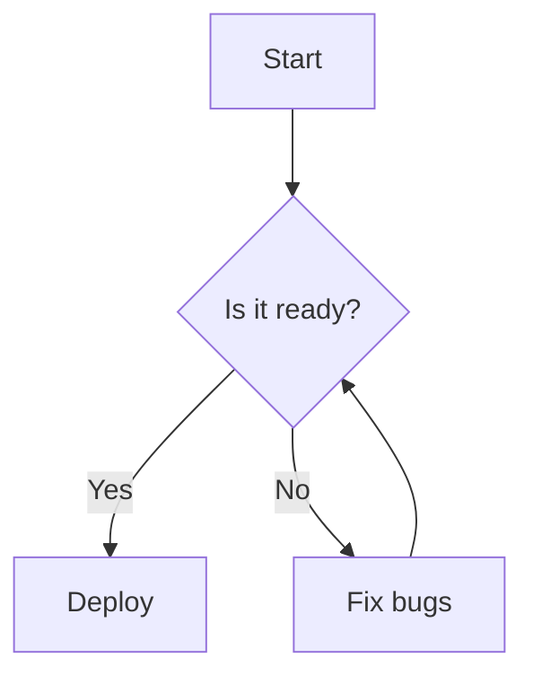

# DependsiT Markdown Studio — User Guide

A complete guide to every feature in Markdown Studio, from your first word to your final export.

---

## Table of Contents

1. [Getting Started](#getting-started)
2. [The Interface](#the-interface)
3. [Writing & Editing](#writing--editing)
4. [Importing Files](#importing-files)
5. [Working with Tabs](#working-with-tabs)
6. [The Command Palette](#the-command-palette)
7. [Find & Replace](#find--replace)
8. [Document Outline](#document-outline)
9. [Document Statistics](#document-statistics)
10. [Word Count Goal](#word-count-goal)
11. [Mermaid Diagrams](#mermaid-diagrams)
12. [Math Formulas (KaTeX)](#math-formulas-katex)
13. [Themes](#themes)
14. [Focus Mode](#focus-mode)
15. [Custom Snippets](#custom-snippets)
16. [Spell Check](#spell-check)
17. [Printing](#printing)
18. [Exporting](#exporting)
19. [Keyboard Shortcuts](#keyboard-shortcuts)
20. [Privacy & Data Storage](#privacy--data-storage)

---

## Getting Started

When you open Markdown Studio, you'll see a welcome document called **"Getting Started.md"**. This is a sample document that demonstrates the editor's capabilities — GFM tables, KaTeX math, Mermaid diagrams, and more.

You can start typing immediately, paste content from your clipboard, import a file, or create a new blank tab. Everything you type is saved automatically to your browser — no account needed, no server involved.

---

## The Interface

The interface has four main areas:

### 1. Toolbar (top bar)

The toolbar runs across the top of the window and contains:

- **File menu** — A dropdown with New File, Import File, and Export options (Markdown, PDF, Word, HTML, Plain Text).
- **Quick Import** (upload icon) — Opens the file picker directly.
- **Quick Export** (download icon) — Instantly downloads the current tab as `.md`.
- **Print** (printer icon) — Opens the browser's print dialog with a print-optimized layout.
- **Toolbar Toggle** (panel icon) — Hides or shows the editor's formatting toolbar (the row of bold/italic/heading buttons). Useful on smaller screens or when you want a distraction-free writing surface.
- **Find** (magnifying glass) — Opens the find/replace bar.
- **Focus Mode** (maximize icon) — Hides the toolbar, tabs, and status bar for distraction-free writing.
- **Outline** (list tree icon) — Opens the document outline sidebar on the right.
- **Statistics** (bar chart icon) — Opens the document statistics panel.
- **Snippet Manager** (bookmark icon) — Opens the custom snippet manager.
- **Command Palette** (command icon) — Opens the command palette for quick access to all actions.
- **Shortcuts** (keyboard icon) — Shows the keyboard shortcuts reference.
- **Theme** (moon/palette/sun icon) — Cycles through Light → Sepia → Dark themes.
- **Reset** (trash icon) — Deletes all tabs and restores the default welcome document.

> **On mobile:** Only the File menu, Command Palette, and Theme buttons are visible to save space. All other features are accessible through the command palette (tap the command icon or use Ctrl+K).

### 2. Tab Bar

Below the toolbar, tabs show your open files. Each tab displays the filename and a close button (×). The active tab has a green underline. You can:

- **Click** a tab to switch to it
- **Double-click** a tab name to rename it
- **Right-click** a tab for a context menu (Duplicate, Rename, Close, Close others, Close all)
- **Drag** a tab to reorder it
- **Click the +** button to create a new untitled tab

On the active tab, you'll see a small word count badge (e.g., "427") showing how many words are in that document.

### 3. Editor (main area)

The editor is a split-pane view:

- **Left pane** — A text editor where you type Markdown. A formatting toolbar at the top provides quick access to bold, italic, headings, lists, links, images, code blocks, and more.
- **Right pane** — A live preview that renders your Markdown as you type. This shows exactly how your document will look when exported.

You can toggle the formatting toolbar on/off using the panel icon in the top toolbar. You can also switch the editor to edit-only, preview-only, or split mode using the buttons at the far right of the formatting toolbar.

### 4. Status Bar (bottom bar)

The status bar shows:

- **Connection status** — A green dot means "Ready" (the editor is loaded). A yellow pulsing dot means the conversion engine is loading.
- **Filename** — The name of the active tab (on wider screens).
- **Word count** — "427w" (427 words).
- **Line count** — "99ln" (99 lines, on wider screens).
- **Reading time** — A clock icon + estimated reading time (e.g., "2 min").
- **Save status** — Green check + "Saved" / "26s ago", or an amber dot + "Unsaved" when you have unsaved changes.
- **Spell check toggle** — A spell-check icon that turns green when on.
- **Word count goal** — A progress ring showing your progress toward a writing goal (if set).
- **Shortcuts** — Keyboard icon linking to the shortcuts reference.
- **About / Privacy / FAQ / Docs** — Quick links to built-in documentation.
- **GitHub** — Link to the source repository.

---

## Writing & Editing

### Basic Markdown

Type standard Markdown syntax and the preview updates instantly:

```markdown
# Heading 1
## Heading 2
### Heading 3

**Bold text** and *italic text*.

- Bullet list item
- Another item

1. Numbered list
2. Second item

> Blockquote text

[Link text](https://example.com)


```

### Formatting Toolbar

The toolbar above the editor provides clickable buttons for common formatting:

- **Bold** (Ctrl+B) — Wraps selection in `**`
- **Italic** (Ctrl+I) — Wraps selection in `*`
- **Strikethrough** (Ctrl+Shift+X) — Wraps selection in `~~`
- **Heading** — Inserts `#` heading
- **Link** (Ctrl+L) — Inserts `[text](url)`
- **Quote** (Ctrl+Q) — Inserts `> ` blockquote
- **Code** — Wraps selection in `` ` ``
- **Code block** (Ctrl+Shift+J) — Inserts a fenced code block
- **Image** — Inserts ``
- **Table** — Inserts a table template
- **Unordered list** (Ctrl+Shift+U) — Inserts `- ` list
- **Ordered list** (Ctrl+Shift+O) — Inserts `1. ` list
- **Task list** (Ctrl+Shift+C) — Inserts `- [ ] ` task
- **View modes** — Toggle between split, edit-only, and preview-only
- **Fullscreen** — Expand the editor to fill the screen

### Auto-Pairing

The editor automatically pairs common Markdown syntax:

- Typing `(` inserts `()` with the caret between them
- Typing `[` inserts `[]`
- Typing `` ` `` inserts ``` `` ```
- Typing `**` (two asterisks) creates a bold pair `**|**`
- Selecting text and typing `*`, `` ` ``, `(`, `[`, or `{` wraps the selection
- Pressing Backspace between an empty pair deletes both characters
- Typing a closing character (`)`, `]`, `}`) when one already exists skips over it

### Spell Check

Spell check is on by default. Toggle it via the spell-check icon in the status bar. Misspelled words will appear with a red underline (browser-native spell check).

### Drag and Drop

You can drag `.md` or `.txt` files directly onto the editor window to open them in a new tab. Other file types (PDF, DOCX, etc.) will be converted to Markdown — see [Importing Files](#importing-files).

---

## Importing Files

Markdown Studio can convert many file formats to Markdown. All conversion happens locally in your browser — your files are never uploaded to a server.

### Supported Formats

| Format | Extensions | Conversion Method |
|---|---|---|
| Markdown | `.md`, `.markdown` | Direct read |
| Plain text | `.txt`, `.text` | Direct read |
| PDF | `.pdf` | pdf.js (client-side text extraction) |
| Word | `.docx` | mammoth.js (HTML → Markdown) |
| PowerPoint | `.pptx` | Pyodide + MarkItDown (WebAssembly) |
| Excel | `.xlsx`, `.csv` | Pyodide + MarkItDown |
| HTML | `.html`, `.htm` | Pyodide + MarkItDown |
| JSON | `.json` | Pyodide + MarkItDown |
| XML | `.xml` | Pyodide + MarkItDown |
| EPUB | `.epub` | Pyodide + MarkItDown |
| RTF | `.rtf` | Pyodide + MarkItDown |

### How to Import

There are three ways to import a file:

1. **File menu** — Click **File → Import File** and choose a file from your device.
2. **Quick Import button** — Click the upload icon in the toolbar.
3. **Drag and drop** — Drag a file from your file manager onto the editor window.

### Conversion Notes

- **PDF files** are parsed using pdf.js, which extracts text and attempts to detect headings based on font size. Scanned PDFs (images only) won't produce text.
- **Word (.docx)** files are converted via mammoth.js, which extracts the HTML content and converts it to Markdown (headings, lists, tables, bold, italic).
- **PowerPoint, Excel, CSV, HTML, JSON, XML, EPUB, RTF** files are converted using Microsoft's MarkItDown library running inside a Pyodide (Python in WebAssembly) background worker. The first conversion takes ~30 seconds while Pyodide downloads and initializes. Subsequent conversions are much faster.
- The maximum file size is 50 MB. Larger files may freeze the browser tab.
- If a conversion fails, you'll see an error message explaining what went wrong.

### What Happens After Import

The converted Markdown opens in a new tab. The filename is preserved with a `.md` extension added if it wasn't already a Markdown file. You can then edit, preview, and export the content like any other document.

---

## Working with Tabs

Markdown Studio supports multiple open documents in tabs, similar to a code editor.

### Creating Tabs

- Click the **+** button at the right end of the tab bar
- Use **File → New File**
- Press **Ctrl+N** (Cmd+N on macOS)
- Import a file (it opens in a new tab)

### Switching Tabs

- Click any tab
- Press **Alt+1** through **Alt+9** to jump to tabs 1-9
- Scroll the tab bar with your mouse wheel if you have many tabs open

### Renaming Tabs

- **Double-click** the tab name and type a new name
- **Right-click** the tab → **Rename**

### Reordering Tabs

- **Drag** a tab left or right to reposition it. A green left border appears on the tab you're about to drop onto.

### Duplicating Tabs

- **Right-click** the tab → **Duplicate**
- Press **Ctrl+Shift+D** (Cmd+Shift+D on macOS)
- Use the command palette (Ctrl+K) → search "duplicate"

The duplicate opens right after the original with " copy" appended to the name.

### Closing Tabs

- Click the **×** on the tab
- **Right-click** → **Close**
- Press **Ctrl+W** (Cmd+W on macOS)

If the tab has unsaved content, a confirmation dialog appears. Empty tabs close immediately without confirmation.

- **Close others** — Right-click → closes every tab except this one
- **Close all** — Right-click → closes all tabs and creates a fresh welcome tab

### Tab Persistence

All tabs are saved to your browser's IndexedDB and restored when you return. This includes tab names, order, and content. Clearing your browser data or clicking the Reset button (trash icon) will delete everything.

---

## The Command Palette

The command palette is the fastest way to access any feature. Think of it as a search bar for the entire editor.

### Opening the Palette

- Press **Ctrl+K** (Cmd+K on macOS)
- Click the **command icon** in the toolbar

### Using the Palette

1. **Type** to search — the palette filters commands as you type using fuzzy matching
2. **Arrow keys** (↑↓) to navigate results
3. **Enter** to execute the highlighted command
4. **Escape** to close

### What's in the Palette

The palette contains **33+ commands** organized into groups:

**Actions:**
- New file, Import file
- Export as Markdown, PDF, Word, HTML, Plain Text
- Print preview
- Cycle theme, Toggle focus mode, Toggle outline
- Find, Find and replace
- Document statistics, Keyboard shortcuts
- Manage snippets, Duplicate current tab

**Insert (Markdown snippets):**
- Heading 1, 2, 3
- Bold, Italic, Inline code, Code block
- Link, Image
- Blockquote
- Bullet list, Numbered list, Task list
- Table, Horizontal rule
- Mermaid diagram, Math block
- Table of contents (auto-generated from your headings)

**My snippets:**
- Any custom snippets you've created (see [Custom Snippets](#custom-snippets))

---

## Find & Replace

### Opening Find

- Press **Ctrl+F** (Cmd+F)
- Click the **search icon** in the toolbar
- Use the command palette → "Find"

### Opening Find & Replace

- Press **Ctrl+H** (Cmd+H)
- Use the command palette → "Find and replace"

### How It Works

1. **Type your search query** — matches are highlighted in the preview pane with an amber background
2. **The counter shows** "1 of 10" — your current match position out of total matches
3. **Navigate matches** — press Enter (or click ↓) for next, Shift+Enter (or click ↑) for previous
4. **Replace** — type replacement text, click "Replace" for the current match or "All" for every match

### Search Options

Three toggle buttons let you refine your search:

- **Aa** (Case sensitive) — Distinguishes uppercase from lowercase
- **W** (Whole word) — Only matches complete words, not substrings
- **.*  (Regex)** — Treats your query as a regular expression

### Highlighting

When the find bar is open, all matches in the preview pane are highlighted with an amber background. The active match is also selected in the editor's textarea. Highlights are removed when you close the find bar (Escape or the × button).

---

## Document Outline

The outline sidebar shows a table of contents built from your document's headings (H1–H6).

### Opening the Outline

- Click the **list tree icon** in the toolbar
- Press **Ctrl+Shift+L** (Cmd+Shift+L)
- Use the command palette → "Toggle outline"

### Using the Outline

- **Click** any heading to jump to it in the preview. The heading briefly flashes green to show where you landed.
- The outline highlights the heading you're currently scrolled to.
- Headings are indented by level (H2 under H1, H3 under H2, etc.).
- The outline opens/closes on the right side of the editor and persists across sessions.

### Generating a Table of Contents

You can insert a clickable table of contents directly into your document:

1. Open the command palette (Ctrl+K)
2. Search "table of contents"
3. Select **Insert: Table of contents**

This generates a nested bullet list with links to every heading in your document. If you have a leading H1 (document title), it's automatically excluded from the TOC.

---

## Document Statistics

The statistics panel provides detailed metrics about your document.

### Opening Statistics

- Click the **bar chart icon** in the toolbar
- Press **Ctrl+Shift+S** (Cmd+Shift+S)
- Use the command palette → "Document statistics"

### What You See

**Counts:**
- Words, Characters (total and without spaces)
- Lines, Paragraphs, Sentences
- Headings, List items, Links, Images, Code blocks

**Readability:**
- **Reading time** — Estimated at 200 words per minute
- **Reading ease** — Flesch reading ease score (0–100, higher = easier). Color-coded: green (easy), amber (moderate), red (difficult)
- **Grade level** — Flesch-Kincaid grade level (years of education needed to understand the text)
- **Longest paragraph** — Word count of your longest paragraph

Code blocks and inline code are excluded from prose analysis so syntax doesn't skew readability scores.

---

## Word Count Goal

Set a writing target and track your progress.

### Setting a Goal

1. Click **"Set goal"** in the status bar
2. Type a word count or click a preset (100, 250, 500, 750, 1000, 2000)
3. Click **Set**

### Tracking Progress

Once set, the status bar shows a **progress ring** with your current count / goal (e.g., "427/500"). The ring fills as you write and turns green when you reach your goal.

### Changing or Removing

Click the progress ring to reopen the goal settings. You can enter a new value, pick a different preset, or click **Remove goal** to clear it.

The goal persists across sessions — it applies to your writing session, not to a specific tab.

---

## Mermaid Diagrams

Create flowcharts, sequence diagrams, Gantt charts, and more using standard Mermaid syntax inside code blocks.

### Creating a Diagram

Type a fenced code block with the `mermaid` language identifier:

````markdown

````

The diagram renders in the preview pane automatically. Supported diagram types include: flowchart, sequence, class, state, ER, Gantt, pie, journey, and more.

### Downloading Diagrams

Hover over any rendered Mermaid diagram to reveal two buttons in the top-right corner:

- **PNG icon** — Downloads the diagram as a PNG image (2x resolution, white background)
- **Download icon** — Downloads the diagram as an SVG vector file

If the PNG export fails (due to browser security restrictions), it automatically falls back to SVG download.

### Inserting a Diagram Template

Use the command palette (Ctrl+K) → search "mermaid" to insert a starter diagram template.

---

## Math Formulas (KaTeX)

Write mathematical formulas using LaTeX syntax, rendered by KaTeX.

### Inline Math

Surround math with single dollar signs:

```markdown
The equation is $E = mc^2$ where $E$ is energy.
```

### Block Math

Surround multi-line formulas with double dollar signs:

```markdown
$$
\frac{1}{\Bigl(\sqrt{\phi \sqrt{5}}-\phi\Bigr) e^{\frac25 \pi}} =
1+\frac{e^{-2\pi}} {1+\frac{e^{-4\pi}} {1+\frac{e^{-6\pi}}
{1+\frac{e^{-8\pi}} {1+\ldots} } } }
$$
```

### Inserting a Math Block

Use the command palette (Ctrl+K) → search "math" to insert a math block template.

---

## Themes

Three themes are available:

- **Light** — Warm paper background (#F5F1E8) with dark text. Default theme.
- **Sepia** — Warm, low-contrast palette (#F4ECD8) for extended reading sessions.
- **Dark** — Dark background (#121212) with light text for night writing.

### Switching Themes

- Click the **theme icon** in the toolbar (moon → palette → sun, cycling through Light → Sepia → Dark)
- Press **Ctrl+J** (Cmd+J) to cycle
- Use the command palette → "Cycle theme"

Your theme choice persists across sessions.

---

## Focus Mode

Focus mode (also called Zen mode) hides the toolbar, tab bar, and status bar for distraction-free writing. The editor widens to a comfortable 820px column centered on screen. The formatting toolbar dims to 45% opacity and reveals on hover.

### Entering Focus Mode

- Click the **maximize icon** in the toolbar
- Press **Ctrl+Shift+Enter** (Cmd+Shift+Enter)
- Use the command palette → "Toggle focus mode"

### Exiting Focus Mode

- Press **Escape**
- Press **Ctrl+Shift+Enter** again
- Click the **"Exit focus"** button (top-right corner)

---

## Custom Snippets

Create reusable Markdown snippets that appear in the command palette.

### Opening the Snippet Manager

- Click the **bookmark icon** in the toolbar
- Use the command palette → "Manage snippets"

### Creating a Snippet

1. Type a **name** (e.g., "Meeting notes template")
2. Type the **body** — this is the Markdown content that will be inserted
3. Use `|` (pipe character) to mark where the caret should land after insertion
4. Click **Add**

### Using a Snippet

1. Open the command palette (Ctrl+K)
2. Search for your snippet by name
3. Select it — the snippet body is inserted at your caret position

### Editing or Deleting

In the snippet manager, hover over a snippet to reveal edit (pencil) and delete (trash) buttons.

Snippets persist across sessions via localStorage.

---

## Spell Check

Browser-native spell check is enabled by default. Misspelled words appear with a red squiggly underline.

### Toggling Spell Check

Click the **spell-check icon** in the status bar. It turns green when on, gray when off.

Right-click a misspelled word to see correction suggestions (this is browser-native behavior).

---

## Printing

Print your document with a clean, paper-optimized layout.

### Printing

- Click the **printer icon** in the toolbar
- Press **Ctrl+P** (Cmd+P)
- Use the command palette → "Print preview"

The print layout automatically:
- Hides the editor, toolbar, tabs, and status bar
- Renders only the preview content in black text on white
- Uses 12pt font with 1.5 line height
- Prevents code blocks, tables, and images from breaking across pages
- Prevents headings from being orphaned at the bottom of a page
- Forces light backgrounds for code blocks and tables

---

## Exporting

Export your document in five formats. All processing happens locally in your browser.

### How to Export

1. Click **File** in the toolbar
2. Select an export format
3. The file downloads to your device

Or use the command palette (Ctrl+K) → search "export".

### Export Formats

| Format | Extension | What You Get |
|---|---|---|
| **Markdown** | `.md` | Raw Markdown source text |
| **PDF** | `.pdf` | Rendered document, Letter size, via html2pdf.js |
| **Word** | `.docx` | Microsoft Word document, via html-docx-js |
| **HTML** | `.html` | Standalone HTML file with inline CSS + KaTeX styles |
| **Plain Text** | `.txt` | Plain text extracted from the rendered preview |

### Export Notes

- **Markdown** exports the raw source as-is.
- **PDF, Word, HTML** all export from the rendered preview (not the raw Markdown), so they include rendered tables, math, diagrams, and formatting.
- **Plain Text** extracts the visible text from the rendered preview (no Markdown syntax).
- If the editor is in edit-only mode (preview not visible), exports automatically render the Markdown off-screen first, so they always produce correct output.
- The filename is based on the tab name (e.g., "Getting Started.md" → "Getting Started.pdf").

---

## Keyboard Shortcuts

Press **Ctrl+/** (Cmd+/) at any time to see the full shortcuts reference.

### File

| Shortcut | Action |
|---|---|
| `Ctrl+S` | Save now (forces immediate save) |
| `Ctrl+N` | New tab |
| `Ctrl+W` | Close tab |
| `Ctrl+Shift+D` | Duplicate tab |
| `Ctrl+K` | Command palette |
| `Ctrl+P` | Print |

### View

| Shortcut | Action |
|---|---|
| `Ctrl+Shift+L` | Toggle document outline |
| `Ctrl+Shift+Enter` | Toggle focus mode |
| `Ctrl+Shift+S` | Document statistics |
| `Ctrl+J` | Cycle theme (Light → Sepia → Dark) |

### Edit

| Shortcut | Action |
|---|---|
| `Ctrl+F` | Find |
| `Ctrl+H` | Find and replace |
| `Enter` | Next match (in find bar) |
| `Shift+Enter` | Previous match (in find bar) |

### Navigation

| Shortcut | Action |
|---|---|
| `Alt+1` – `Alt+9` | Switch to tab 1–9 |
| `Ctrl+/` | Show keyboard shortcuts help |
| `Escape` | Close dialog / bar / menu |

### Editor (formatting)

| Shortcut | Action |
|---|---|
| `Ctrl+B` | Bold |
| `Ctrl+I` | Italic |
| `Ctrl+Shift+X` | Strikethrough |
| `Ctrl+L` | Insert link |
| `Ctrl+Q` | Blockquote |
| `Ctrl+J` | Cycle theme |
| `Ctrl+Shift+J` | Code block |

> On macOS, use **Cmd** instead of **Ctrl** for all shortcuts.

---

## Privacy & Data Storage

### Your Data Stays on Your Device

Markdown Studio is 100% client-side. There are no servers, no databases, no analytics, and no tracking scripts. Everything you write, import, and export happens inside your browser.

### Where Your Data Is Stored

- **Tab content** — IndexedDB (handles large documents better than localStorage)
- **Tab metadata** (names, order, active tab) — localStorage
- **Theme preference** — localStorage
- **Outline open/closed state** — localStorage
- **Word count goal** — localStorage
- **Custom snippets** — localStorage

### Clearing Your Data

- Click the **Reset button** (trash icon) in the toolbar to delete all tabs and restore the welcome document
- Clear your browser data for the site to remove everything (IndexedDB + localStorage)

### What's Not Stored

- No cookies
- No analytics
- No tracking pixels
- No server-side logs
- No account or login

---

## Install as an App (PWA)

Markdown Studio can be installed as a Progressive Web App for a native-like experience:

- **Chrome/Edge** — Click the install icon in the address bar, or click the green "Install" button in the toolbar
- **Firefox** — Not supported (Firefox doesn't support PWA installation)
- **Safari (iOS)** — Tap Share → Add to Home Screen
- **Safari (macOS)** — File → Add to Dock

Once installed, the app opens in its own window, works offline, and appears in your app launcher.

---

## Need Help?

- **Keyboard shortcuts** — Press Ctrl+/ or click the keyboard icon
- **About** — Click "About" in the status bar
- **FAQ** — Click "FAQ" in the status bar
- **Source code** — [github.com/Depends-iT/dependsit-markdown-studio](https://github.com/Depends-iT/dependsit-markdown-studio)
- **Report a bug** — [GitHub Issues](https://github.com/Depends-iT/dependsit-markdown-studio/issues)
